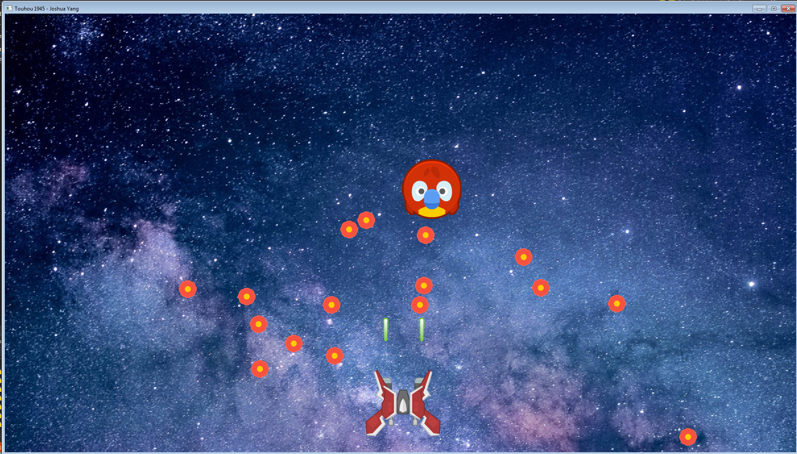

## Touhou-1945
Code Design and Data Structures Assessment

## Requirements
Before you formally start on your project, you will be required to submit a brief covering the basic premise of your project and how you intend to meet assessment requirements in that project.

At the bare minimum, your game project should make use of or incorporate the following elements:

-rendering capabilities (likely by leveraging a third-party library)

-a graphical user interface (GUI buttons, text, etc.)

-use of assets from disk (sounds, images, file I/O)

-input-checking and response

**Since this is the second assessment project, we are primarily looking for growth in your programming abilities.** While you were permitted to write the most egregious code for your first assessment, we expect you to have learned and developed strategies for solving problems with programming.

In other words, you should design your application with intention: how can you design the most organized and readable code (without compromising your productivity)?

## My Implementation

Basic Space Shooter

Controls
Move -

	UP
  
	Down
  
	Left
  
	Right
  
Shoot -

	Left Control

More focus on the code design and structure than the gameplay it self.

Used prototype design to load bullets that have the same sprite

Used object pool for laser and boss bullets

Used inheritance to control boss and player object

Used polymorphsim to contorl boss AI
